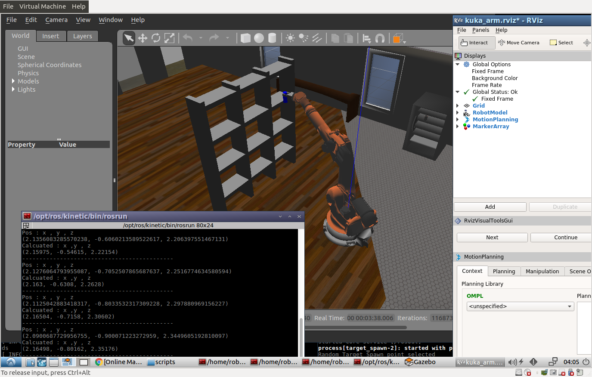
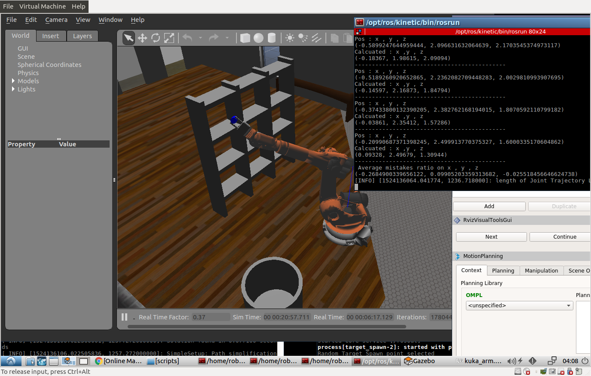
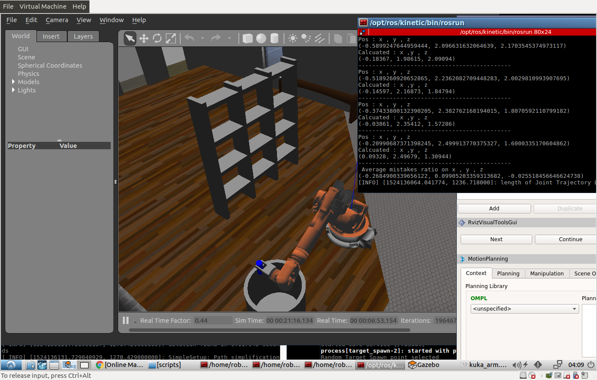

# Kuka KR210 Pick and Place Project

### Denavit-Hartenberg parameters :
from the URDF File we can creat the following DH parameters :
| n |  theta |   d   |    a   | alpha |
|:-:|:------:|:-----:|:------:|:-----:|
| 0 |   -    |   -   |    0   |   0   |
| 1 | theta1 |  0.75 |  0.35  | -pi/2 |
| 2 | theta2 |   0   |  1.25  |   0   |
| 3 | theta3 |   0   | -0.054 | -pi/2 |
| 4 | theta4 |  1.5  |    0   |  pi/2 |
| 5 | theta5 |   0   |    0   | -pi/2 |
| 6 | theta6 | 0.303 |    0   |   0   |

### Creating Rotation Arrays :
```python
        r_x = Matrix([[ 1,      0,       0],
                      [ 0, cos(r), -sin(r)],
                      [ 0, sin(r),  cos(r)]])

        r_y = Matrix([[  cos(p), 0, sin(p)],
                       [       0, 1,      0],
                       [ -sin(p), 0, cos(p)]])

        r_z = Matrix([[ cos(y), -sin(y), 0],
                       [ sin(y),  cos(y), 0],
                       [      0,       0, 1]])
        ROT_0EE = simplify(r_z * r_y * r_x)
```
where ROT_0EE represents the total rotaion from the base to the End Effector
and we should write the Correction to account for orientation difference between definition of gripper link in URDF file and the DH convention. (rotation around Z axis by 180 deg and X axis by -90 deg)

```python
    R_c = simplify(r_z * r_y)
	R_c = R_c.evalf(subs={y:pi ,p:(-pi/2)})
```
R_c represents the Correction 

## Forward kinematics :
for optimization instead of create array for every transform we create Function and it returns the Transform Matrix
```python
   def T_Matrix(alpha,a,d,q):	
		TF = Matrix([[cos(q), -sin(q), 0, a],
     		[sin(q)*cos(alpha), cos(q)*cos(alpha), -sin(alpha), -sin(alpha)*d],
    		[sin(q)* sin(alpha), cos(q)*sin(alpha), cos(alpha), cos(alpha)*d],
    		[0,0,0,1]])
    		return TF
```
#### Create individual transformation matrices :
```python
   T0_1 = T_Matrix(alpha0, a0, d1, q1).subs(DH_Table)
  	T1_2 = T_Matrix(alpha1, a1, d2, q2).subs(DH_Table)
 	T2_3 = T_Matrix(alpha2, a2, d3, q3).subs(DH_Table)
  	T3_4 = T_Matrix(alpha3, a3, d4, q4).subs(DH_Table)
 	T4_5 = T_Matrix(alpha4, a4, d5, q5).subs(DH_Table)
  	T5_6 = T_Matrix(alpha5, a5, d6, q6).subs(DH_Table)
  	T6_EE = T_Matrix(alpha6, a6, d7, q7).subs(DH_Table)
  	T0_G = simplify(T0_1 * T1_2 * T2_3 * T3_4 * T4_5 * T5_6 * T6_EE )
```
Where Ta_b represents the Total Transform from Frame a to Frame b 
and T0_G the Total Transform from base to the Gripper

## Inverse kinematics :
Calculating The total rotation Matrix by evaluating the Matrix R0T0_EE with Row Pitch and Yaw 
Calculating the Wirst Center (WC) from the equation 
```
  WC = P - D* N
```
Where P the Pos Matrix D the link length of the Gripper :


### Using this Code we can calculate the Joints Angles : 
```python
 theta1 = atan2(WC[1], WC[0]) 
	    side_a = 1.501
	    side_b = sqrt(pow(sqrt(WC[0] * WC[0] + WC[1] * WC[1]) - 0.35, 2)+ pow((WC[2] - 0.75), 2))
	    side_c = 1.25
 
	    angle_a = acos((side_b * side_b + side_c * side_c - side_a * side_a) / (2 * side_b * side_c))
	    angle_b = acos((side_a * side_a + side_c * side_c - side_b * side_b) / (2 * side_a * side_c))
	    angle_c = acos((side_a * side_a + side_b * side_b - side_c * side_c ) / (2 * side_a * side_b))

	    theta2 = pi/2. - angle_a - atan2(WC[2] - 0.75, sqrt(WC[0] + WC[1] * WC[1]) - 0.35)
	    theta3 = pi/2. - (angle_b + 0.036) 
	    R0_3 = T0_1[0:3,0:3] * T1_2[0:3,0:3] * T2_3[0:3,0:3]
	    R0_3 = R0_3.evalf(subs={q1: theta1, q2:theta2, q3: theta3})


	    R3_6 = R0_3.transpose() * R0_6 * R_c

	    theta4 = atan2(R3_6[2,2], -R3_6[0,2])
	    theta5 = atan2(sqrt(R3_6[0,2]*R3_6[0,2] + R3_6[2,2] * R3_6[2,2]), R3_6[1,2])
	    theta6 = atan2(-R3_6[1,1], R3_6[1,0])
```
### Calculate the mistake percentage :
By Calcuating the end-effector position via Forward Kinematics using code output (which is a set of joint angles) and comparing it with the end-effector position we received in the initial 
```python
P_new = Matrix ([[px_new] ,
			     [py_new] ,
			     [pz_new] ,
			     [1]])
	    base = Matrix ([[0] ,
			    [0] ,
			    [0] ,
			    [1]])
    	T0_G_eval = T0_G.evalf(subs={q1 : theta1 , q2 :theta2 ,q3 : theta3 ,q4 : theta4 ,q5 : theta5 ,q6 : theta6})
	    P_new = T0_G_eval  * base 
	    print ("Pos : x , y , z")
	    print (px , py , pz )
	    print ("Calcuated : x ,y , z  ")
	    x_new = round(P_new[0],5)
	    y_new = round(P_new[1],5)
	    z_new = round(P_new[2],5)
	    print ( x_new , y_new  ,z_new  )
	    mis_x = mis_x + (px - x_new)
	    mis_y = mis_y + (py - y_new)
	    mis_z = mis_z + (pz - z_new)
	    print ("--------------------------------------------")
```
and in the end we print the average 
```python 
aver_x = mis_x / len(req.poses)
aver_y = mis_y / len(req.poses)
aver_z = mis_z / len(req.poses)
print (" Average mistakes ratio on x , y , z")
print (aver_x , aver_y , aver_z)
```
## Screenshots :



